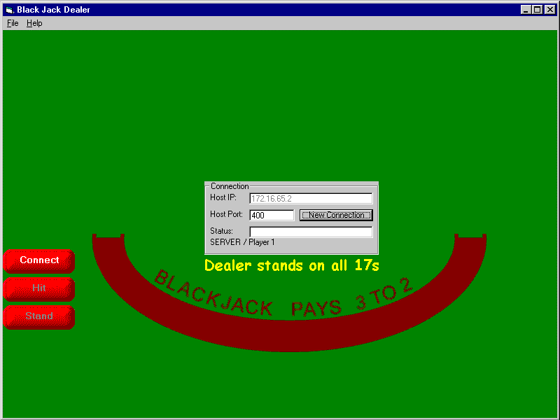



## Black Jack Client \- Server using TcpIp

### Description

This was my Diploma project.There is some "Nice" complex networking code here.

Control arrays, dynamic object creation...so much fun...:-)

There is sound in the game too. There are 2 programs (Client and Server) ther is also a read me.

Please give me some feedback. egan007@netscape.net

You can use all this code - if you do please return the favour by voting for me thanks :)
 
### More Info
 

             |
---                |---
**Submitted On**   |2000-03-14 14:01:10
**By**             |[Kevin Egan](https://github.com/Planet-Source-Code/PSCIndex/blob/master/ByAuthor/kevin-egan.md)
**Level**          |Advanced
**User Rating**    |4.0 (12 globes from 3 users)
**Compatibility**  |VB 6\.0
**Category**       |[Games](https://github.com/Planet-Source-Code/PSCIndex/blob/master/ByCategory/games__1-38.md)
**World**          |[Visual Basic](https://github.com/Planet-Source-Code/PSCIndex/blob/master/ByWorld/visual-basic.md)
**Archive File**   |[CODE\_UPLOAD8598842000\.zip](https://github.com/Planet-Source-Code/kevin-egan-black-jack-client-server-using-tcpip__1-10388/archive/master.zip)

